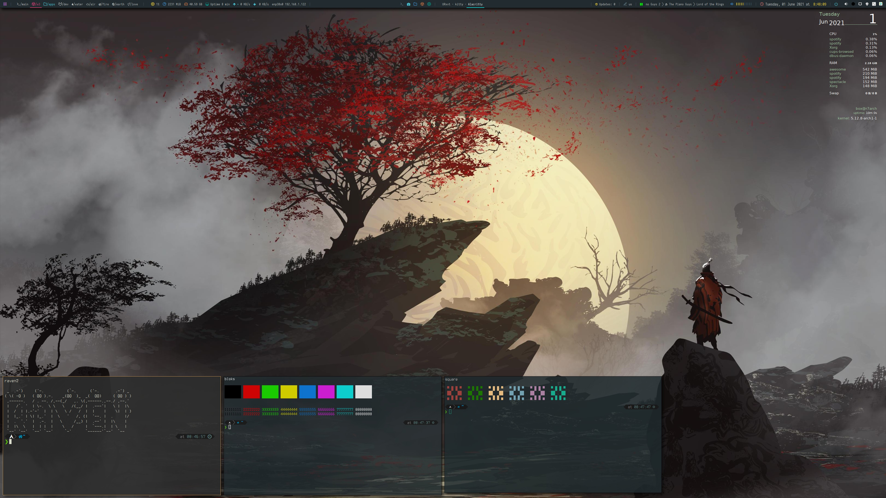
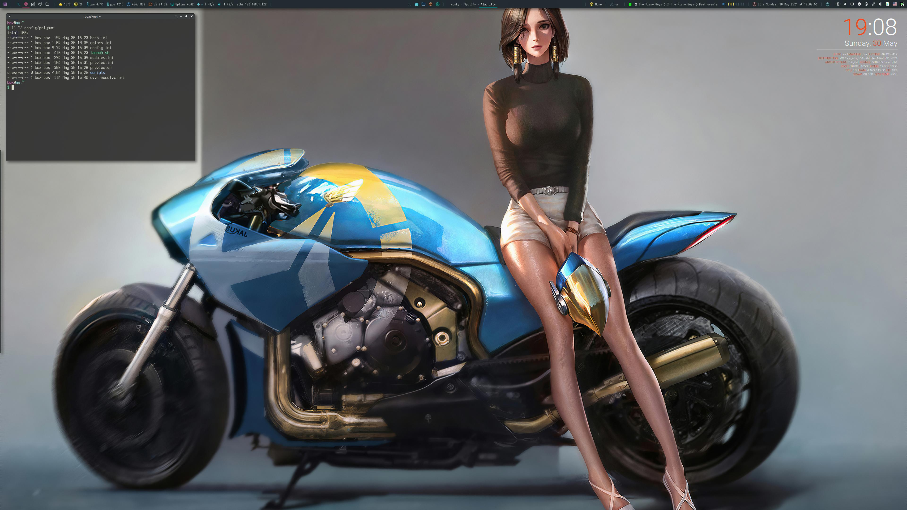
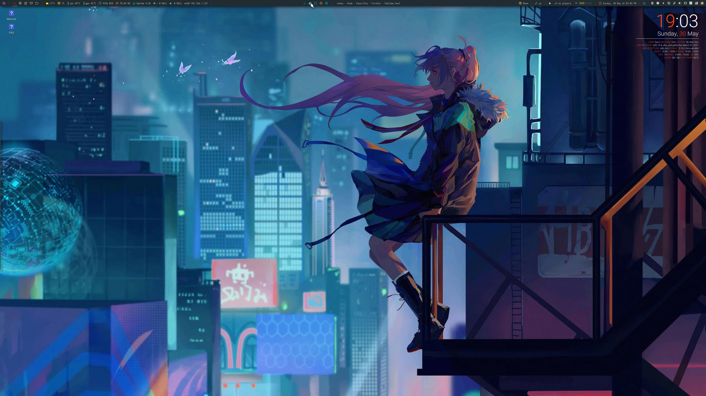

# Advanced Polybar Module Configuration (MX-Linux/Debian and Arch Distros)

Polybar configuration with patched and improved modules for Awesome, i3 and XFCE4. Base design fits to **MX-Linux (Debian Stable) and Arch Distros**.

## Inherited and extended sources

This project configures and extend github polybar sources from

* **polybar-themes (adi1090x)** - forest theme - https://github.com/adi1090x/polybar-themes
* **polywins (alnj)** - https://github.com/alnj/polywins
* **polybar-mpris (0jdxt)** - https://github.com/0jdxt/polybar-mpris
* **polybar-scripts** - https://github.com/polybar/polybar-scripts
* **dotfiles by Derek Taylor (DT)** - https://gitlab.com/dwt1/dotfiles
* **My personal scripts** and modifications for several modules

*NOTE:* If you love this polybar - please add **git stars to listed projects!**

## Screenshots

##### Polybar Forest/Default in AwesomeWM


##### Polybar Forest/Gruvbox FXCE4 with MPRIS - Spotify, Netflix, Youtube, text cycling and improved controls Example


##### Polybar Forest/Default i3 Configured Modules Example


## MAIN GOALs

The main goal of this project is complete and enhanced configuration of polybar modules for MX-Linux and Arch systems.

Inherited actual theme is **Forest** with few styles colormaps from:

https://github.com/adi1090x/polybar-themes/tree/master/simple/forest

Supported all modules already included in the polybar-themes project.

### Added Enhanced Modules

* **Weather Module** for Open Weather site with Nerd Fonts.
* **MPRIS Module** - with scrolling and activity icon - support all players Spotify, MPD, Youtube, Netflix,...
* **Polywins Module** - Opened application administration support
* **Network Improved Modules**
* **AMD Ryzen and new AMD GPUs Temperatures Modules**
* **Workspaces Enhanced Module**
* **Update Module** - for MX-Linux and Arch Distros
* **System Module** - for MX-Linux and Arch Distros changed

## Dependencies

Install following programs on your system before you use these themes.

* **Polybar** : Ofcourse, the bar itself
* **Rofi** : App launcher, network, power and style menus
* **networkmanager_dmenu** : network modules (debian only)
* **mpris** and **playerctl** : Spotify and other music services
* **zscroll** : Text cycling library for music player (zscroll-git from AUR or compile it directly from git for Debian)
* **wmctrl** : polywins service library

### Fonts

Here's a list of all fonts used by these themes.

**`Text Fonts`**

- Iosevka Nerd Font
- Noto Sans
- Droid Sans
- Terminus

**`Icon Fonts`**

- Iosevka Nerd Font
- Icomoon Feather

I strictly recommend to call `setup.sh` script from `polybar-themes` git repo, because it is installed all necessary fonts from here:
https://github.com/adi1090x/polybar-themes/tree/master/fonts

### Installation

Follow the steps below to install polybar on your system.

- First, Clone this repository -
```
$ git clone https://github.com/raven2cz/polybar-config
```

- Change to cloned directory and make setup.sh executable -
```
$ cd polybar-config
$ chmod +x scripts/*
```

- Backup your polybar settings (if you already have).
- Copy dir polybar dir `.` to your `~/.config/polybar` user directory.
- **That's it, This polybar is now installed on your system.**

### Polybar Configuration

- Set correct network interfaces

```
In user_modules.ini:
module/networkspeedup
module/networkspeeddown
module/wired-network

# set correct interface parameter
interface = enp38s0
```

- Set correct sensors for your CPU and GPUs

```
In modules.ini:
temp-gpu and temp-cpu modules
call:
for i in /sys/class/hwmon/hwmon*/temp*_input; do echo "$(<$(dirname $i)/name): $(cat ${i%_*}_label 2>/dev/null || echo $(basename ${i%_*})) $(readlink -f $i)"; done
and copy required sensors values to the fields.
```

- Set your free/paid OpenWeather API ID and City in script `weather.py`.

**NOTE:** For **AwesomeWM** only, set `modules.ini` module workspaces: `pin-workspaces = false` and `config.ini`: `override-redirect = true`
In addition, there is necessary to make trick - create empty wibar with same length and insert it to same position with polybar.

- **That's it, the polybar is fully configured now.**

### Launch the bar

To launch the bar with the selected theme, Just...

- Open the terminal and enter the following command -
```
$ bash ~/.config/polybar/launch.sh
```

- You can add the same command to your WM *autostart file* to launch the bar on login. For example, to launch the bar at startup on openbox, add following lines in **`$HOME/.config/openbox/autostart`** This polybar is optimized for fce4, i3 and partially for awesomewm. But it can be used for many others VMs with little modifications.

```
## Launch Polybar
bash ~/.config/polybar/launch.sh
```

### Change Colormap of Themes

`Right-Click` to launcher button (left side first button with rofi) starts the **selector of color maps**. Select Look and Feel.
